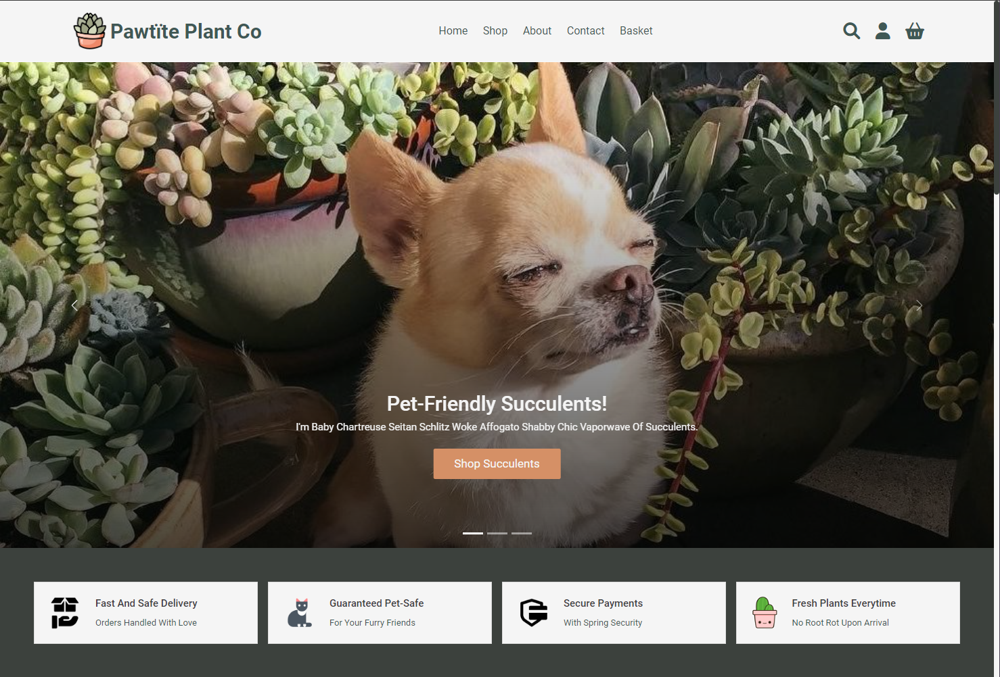
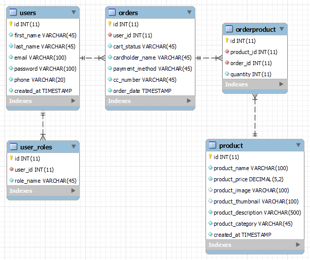
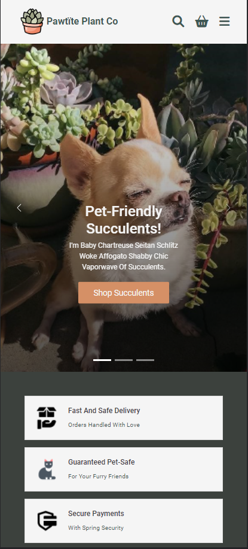
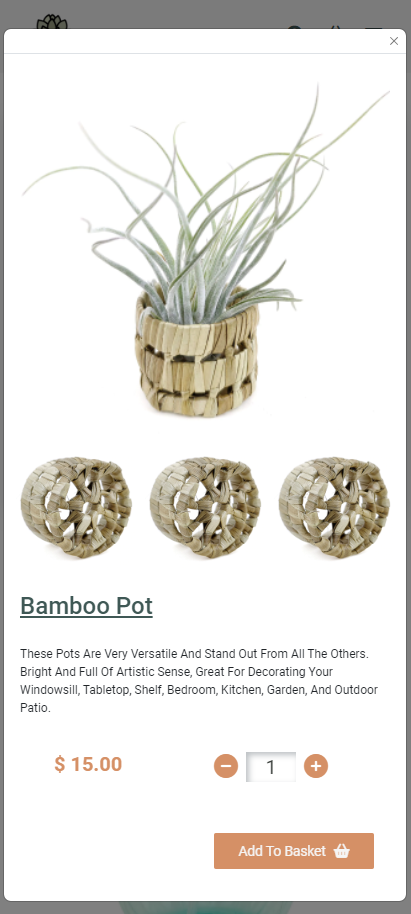
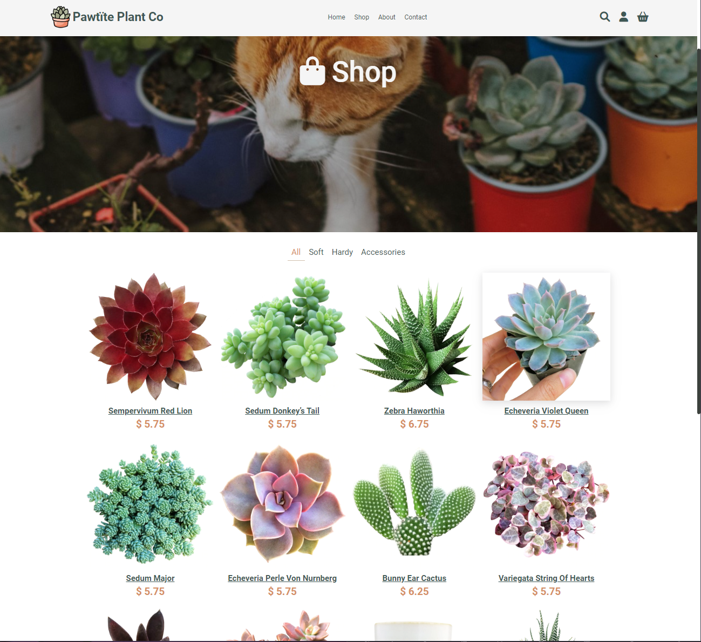
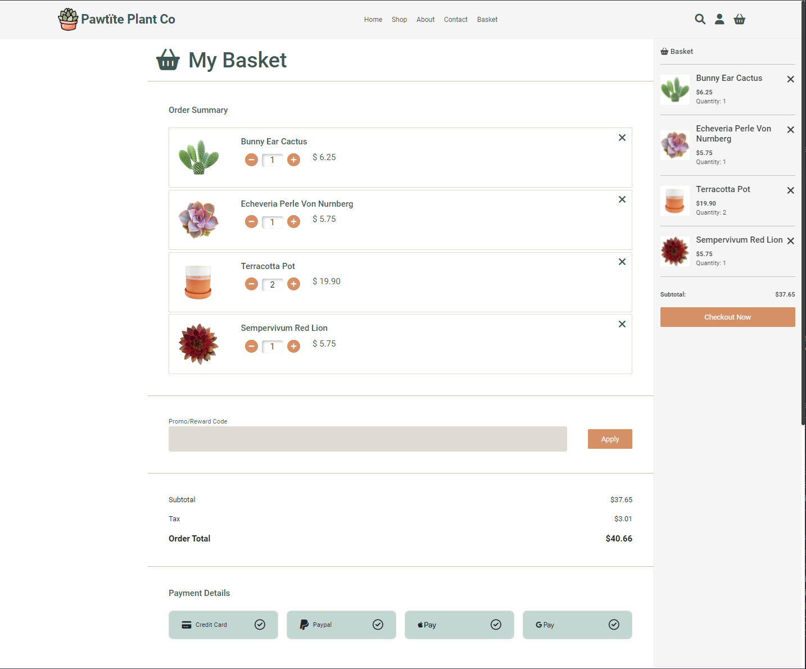
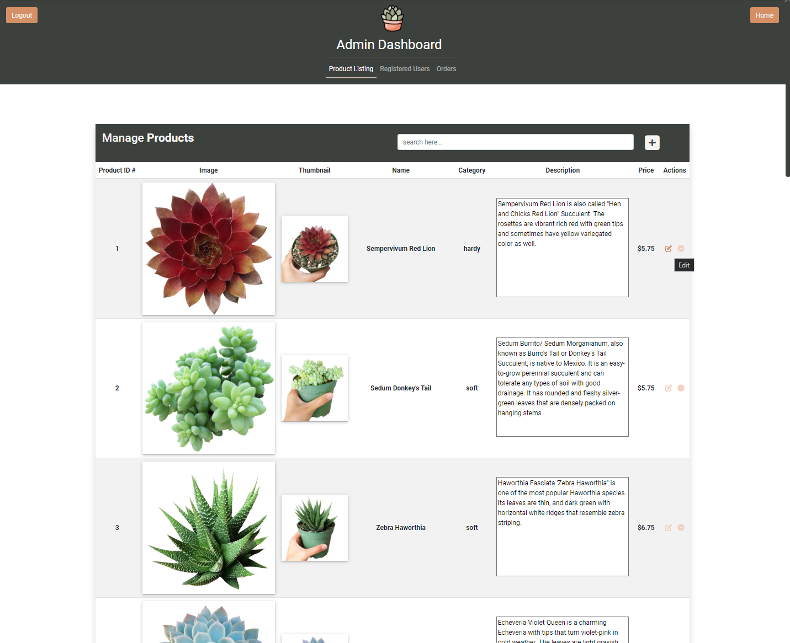

 

  

  <h1 align="center">Pawt&iuml;te Plant Co</h1>

 

  
Table of Contents

  <ol>
    <li><a href="#about-the-project">About The Project</a> </li>
    <li><a href="#built-with">Built With</a></li>
    <li><a href="#entity-relationship-diagram-(erd)">Entity Relationship Diagram (ERD)</a></li>
    <li><a href="#usage">Usage</a></li>
    <li><a href="#future-development">Future Development</a></li>
    <li><a href="#contact">Contact</a></li>
  </ol>

  ## About The Project

  

  Pawt&iuml;te Plant Co is an E-commerce web application that features pet-friendly succulents and goods for plant-lovers and animal-lovers alike!

  ## Built With

  * HTML
  * CSS
  * Boostrap 5
  * Javascript
  * Java
  * Spring Boot
  * Spring Data
  * Spring Security
  * JUnit
  * MySQL
  * Hibernate
  * Maven
  * Tomcat Webserver

  ## Entity Relationship Diagram (ERD)

  Database Structure:

  

  
  ## Usage

- Users will be able to make a purchase on the shop page, add items to a cart and complete a purchase upon checkout.
- If the User is registered, products previously placed in a cart will be saved and be available upon login.
- Admins have access to the site's products, registered users and orders.
- Admins may create, edit and delete products in the product listing.

Responsive Pages:

Shop Page:

Checkout Page and Open Basket Sidebar:

Admin Page:

## Future Development

- Add search functionality within admin pages and main navbar.
- Complete contact form functionality
- Finish 100% unit test coverage.
- Success messages upon completed forms.
- Populate User's order history.
  
## Contact

Email: [JessicaLF17@yahoo.com]

Project Link: [https://github.com/Jfatim/PawtitePlantCo-WebApp]
